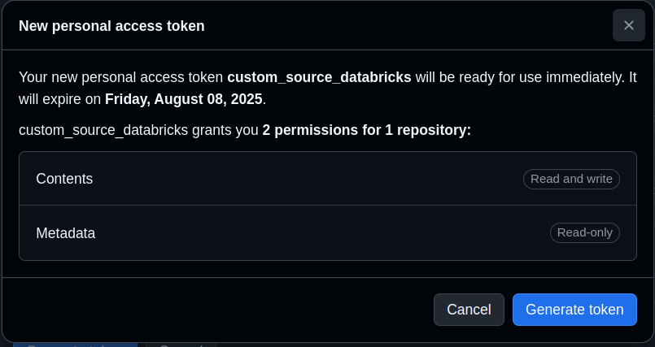
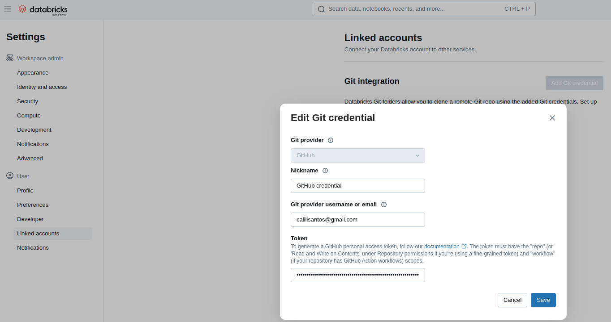
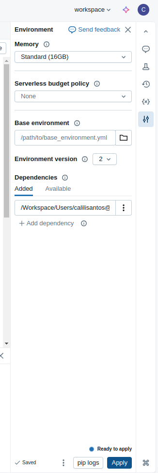

# Boas vindas ao Spark Custom Connectors!

O objetivo é exemplificar o uso do `pyspark.sql.datasource` com a criação de um formato no **pyspark** e o compartilhamento dele no Databricks via pacote python.

## Compartilhando formato no Databricks:

### **1º Clonando esse repositório no Databricks (inclusive Free Edition):**

* Nas Configurações da sua conta no **GitHub**, no menu `Developer Settings > Personal access tokens > Fine grained tokens (recomendado)`, crie um token com a permissão `Contents` à nível do repositório a ser clonado.

  * **Imagem 01 - Criando token Github:**

    

* No Databricks, acesse o menu `Settings > Linked accounts`, clique no botão `Add Git credential` e cole o token gerado no `Github`

  * **Imagem 02 - Criando Git credential no Databricks:**

    

* No seu Workspace Databrics, clique no botão `Create` e selecione `Git Folder`, informando a url **HTTPS** do repositório **Github**

### **2º Adicionando pacote no notebook:**

* Crie um notebook no seu workspace Databricks, e no seu menu `Environment` clique no botão `Add dependency`, e selecione o caminho do diretório `custom_sources` do repositório clonado na sua workspace

  * **Imagem 03 - Instalando pacote python no notebook Databricks:**

    

### **3º Consumindo formato:**
No notebook criado, cole o código abaixo para consumir a fonte `chucknorris` do pacote instalado:

```python
from chuck_norris_source import ChuckNorrisDataSource

spark.dataSource.register(ChuckNorrisDataSource)

(
    spark.read.format("chucknorris")
        .option("count", 3)
            .load()
                .show(truncate=False)
)
```
